# openITCOCKPIT-Desktop
Die openITCOCKPIT-Desktop-App ist eine Standalone-Application, die auf jedem modernen Betriebssystem installiert werden kann und einen Überblick über aktuelle Überwachungsereignisse und Statusaktualisierungen bietet. openITCOCKPIT-Desktop nutzt die openITCOCKPIT HTTP API zur Kommunikation mit dem openITCOCKPIT Server.

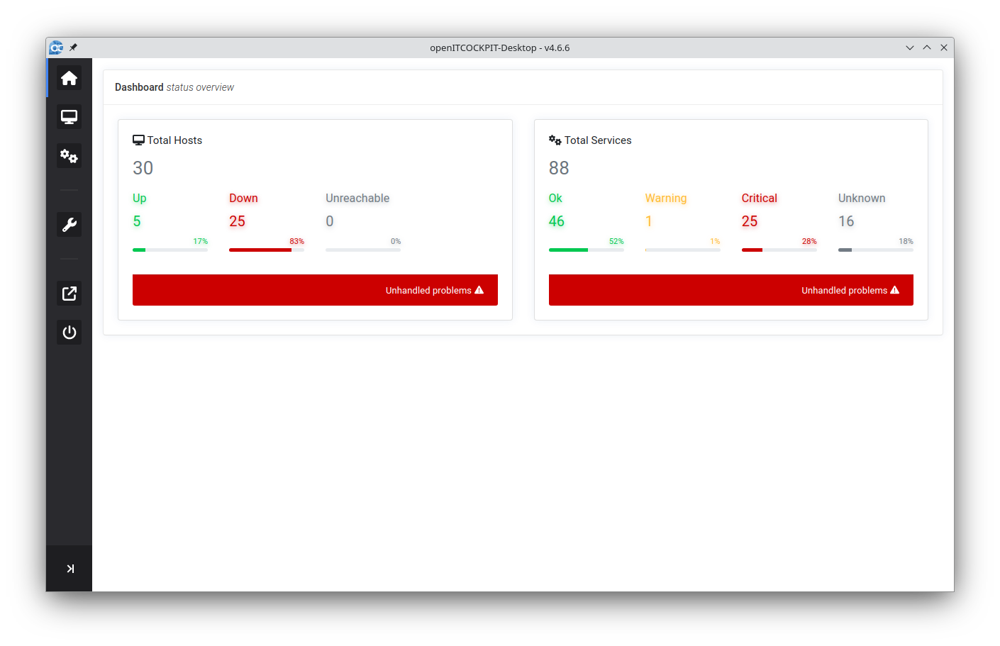


Mit Version 4.7.0 ist das Dashboard um die taktischenÜbersichten, die der angemeldete Benutzer im oitc-Dashboard besitzt erweitert worden.
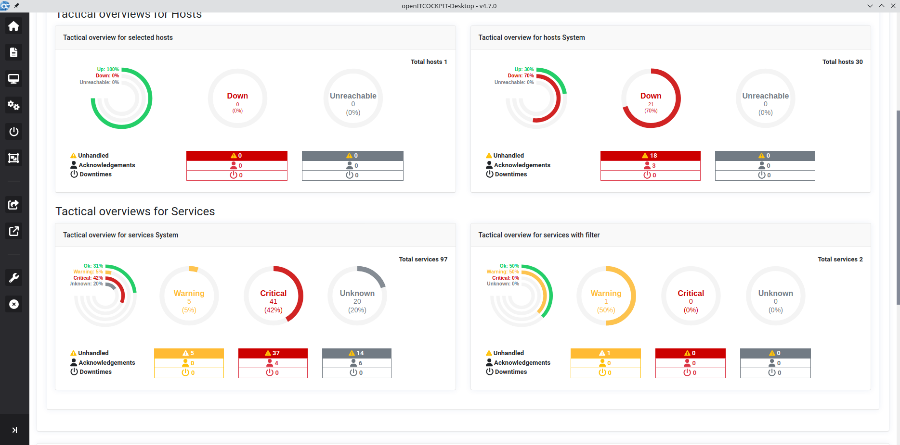

###### Weiterhin sind mit Version 4.7.0 folgende Element hinzugefügt worden:

* Statusseiten
* Notifications Index
* Gruppen (Hosts, Services)
* System Wartungen

!!! info
    Wegen Api-Anpassungen benötigt die Version 4.7.0 für volle Funktionalität mindestens openITCOCKPIT Version 4.8.1 als Backend.


### Installation
* Es stehen für jedes Betriebssystem - Linux, Windows, Macos - entsprechende Installationspakete zur Verfügung.
* Es kann in der App eingestellt werden, dass beim Start - oder manuell über die Settingsseite - automatisch nach Updates gesucht wird.

## Anwendung
### Login

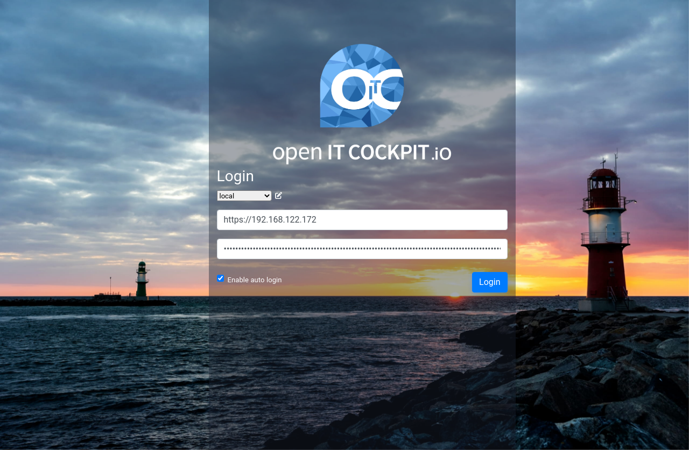

Im ersten Feld `Ihre Server-URL` geben Sie bitte die URL oder IP-Adresse Ihres openITCOCKPIT Systems an.
Im zweiten Feld geben sie den Api-Key eines Benutzers des openITCOCKPIT Systems ein.
#### Erstellung des API Keys
Um sich einloggen zu können, müssen Sie zunächst einen API Key auf
Ihrem openITCOCKPIT System erstellen ([siehe API Key erstellen](../../development/api/#api-keys)). Den Key können Sie einfach im Feld `Ihr Api-Key` einfügen.

#### Autologin
Ist auto login eingestellt (default) werden die Logindaten nach erfolgreichem Login automatisch gespeichert und beim nächsten Start der Application erfolgt das Login automatisch.

#### Profile
Über das Dropdown auf der Loginseite könnensie verschiedene Profile anlegen.
Alle Einstellungen, die sie in der App vornehmen, werden in dem gerade aktiven Profil gespeichert.

Nach erfolgreichem Login werden Sie auf das Dashboard weitergeleitet.

### Settings
Sämtliche Einstellungen auf der Settingsseite werden automatisch gespeichert!
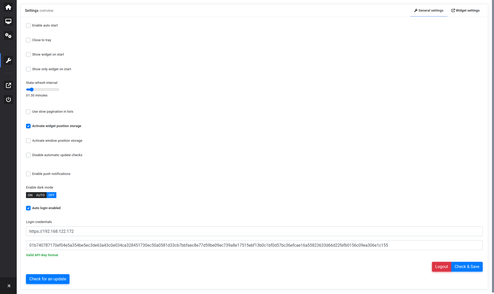

* **Enable auto start**
Die Anwendung wird beim Start des Bestriebssystem mitgestartet (beta)

* **Close to tray**
Beim Schliessen der Anwendung über die Anwendungsleiste wird die Anwendung nicht beendet sondern nur versteckt, kann über das Tray-Icon menü wieder zur Anzeige gebracht werden.

* **Show widget on start**
Das Widget wird beim Starten der Anwendung angezeigt.

* **Show only widget on start**
Beim Starten der Anwendung wird nur das Widget zur Anzeige gebracht.
Die Hauptanwendung kann über das Menü im Tray zur Anzeige gebracht werden.

* **State refresh interval**
Das interval der Abfrage der Daten für das Widget und das Dashboard (min. 1 Minute).

* **Use slow pagination in lists**
Umschalten der Paginierung

* **Activate widget position storage**
Speichert  automatisch die Position des Widgets

* **Activate window posisiton storage**
Speichert automatisch die Postion und Größe der Anwendung

* **Disable automatic update checks**
Schaltet den Updatecheck beim Start der App aus.

* **Enable push notifications**
Schaltet Pushbenarichtigungen an/aus.

* **Enable dark mode**
ON/OFF schalten den Dark Mode explizt an/aus. Auto schaltet den Modus anhand der Betriebssystemeinstellung.

* **Auto login enabled**
Die Anwendung loggt sich beim Start automatisch mit den letzten aktiven Anmeldedaten (Profil) ein.

* **Logout**
Die Anwendung loggt sich aus und springt zur Loginseite, etwa um das Profil zu wechseln oder zu editieren.

* **Check & save**
Prüft und speichert die Anmeldedaten des aktiven Profils

* **Check for update**
Expliziter Check ob ein Update für die App vorhanden ist.

### Widget settings
* Über den **Widget settings** Tab auf der Settingsseite kann der Filter für das Widget definiert werden und die Reihenfolge der Widgetanzeige per Drag & Drop bestimmt werden.


### Widget
* Die zweite Zeile des Widgets zeigt die unhandled Anteile.
* Mit Hilfe des Icons kann das Widget positioniert werden.
* Beim Klicken uf einen Widgeteintag wird die entsprechende List in der Anwendung zur Anzeige gebracht.


### Tray
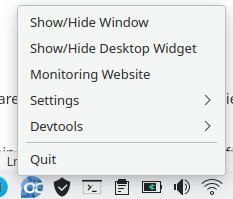
Über das Trayicon (Rechtsclick) können ebenfalls einige Einstellungen vorgenommen werden.

## Personalisierung

Die openITCOCKPIT-Desktop Anwnedung ist in der Lage, sich der Identität des jeweiligen Unternehmens anzupassen.
Dazu können das Appicon (Anwendungleiste, Tray, Widget), das Logo der Loginseite und das Hintergrundbild der Loginseite getauscht werden.

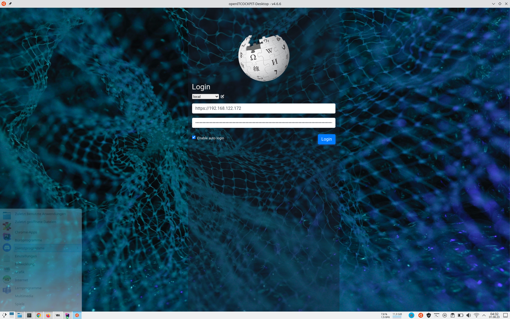

Dazu muss innerhalb des Konfigurationsverzeichnisses der Anwendung ein Ordner names **customAssets** angelegt (verlinkt) werden.

Das Konfigurationsverzeichnis liegen je nach Betriebssystem an folgenden Orten:

Windows
```bash
c:\Benutzer\<user>\AppData\Roaming\openITCOCKIT-Desktop
```
OSX
```bash
/users/<user>/Library/Application Support/openITCOCKIT-Desktop
```
Linux
```bash
/home/<user>/.config/openITCOCKIT-Desktop
```

### customAssets
Innerhalb des Ordners customAssets müssen folgende Dateinamenkonventionen beachtet werden:

**Icon**: favicon.png
Nur png als Endung erlaubt.
Je nach Betriebssystem sollten die Dimensionen etwas anders sein:
Windows: mindestens 64x64, besser 256x256
Linux: gilt dasselbe wie für Windows
OSX: maximal 32x32, besser 16x16 - da sonst das Icon oben in der Leiste zu groß wird.

**logo**: logo.png (.svg,.jpg)
Auflösung beliebig, da skaliert wird

**background**: background.png (.svg, .jpg)
Auflösung im Prinzip auch beliebig, da skaliert wird, sollte aber mindestens FullHD sein.

## Hosts, Services

Die Host-, Services-Views und ihre Detailseiten sind von den entsprechenden Seiten der Weboberfläche des oitc-Servers abgeleitet und werden deshalb hier nicht näher ausgeführt.
### Hostslist
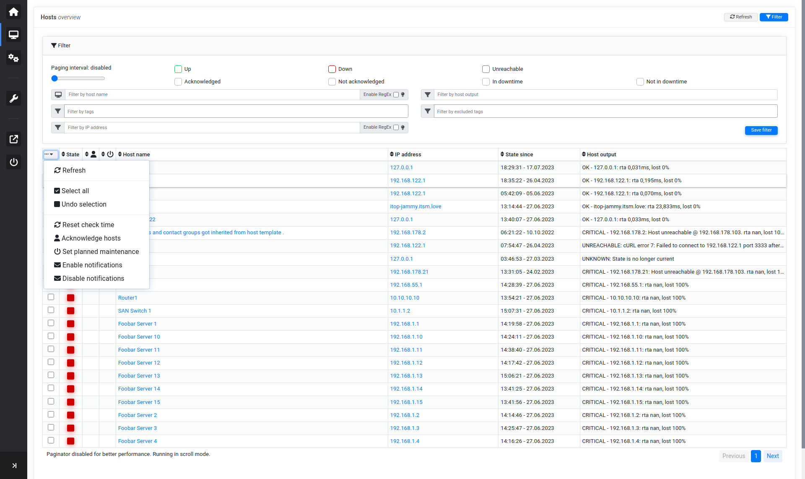
### Hostbrowser
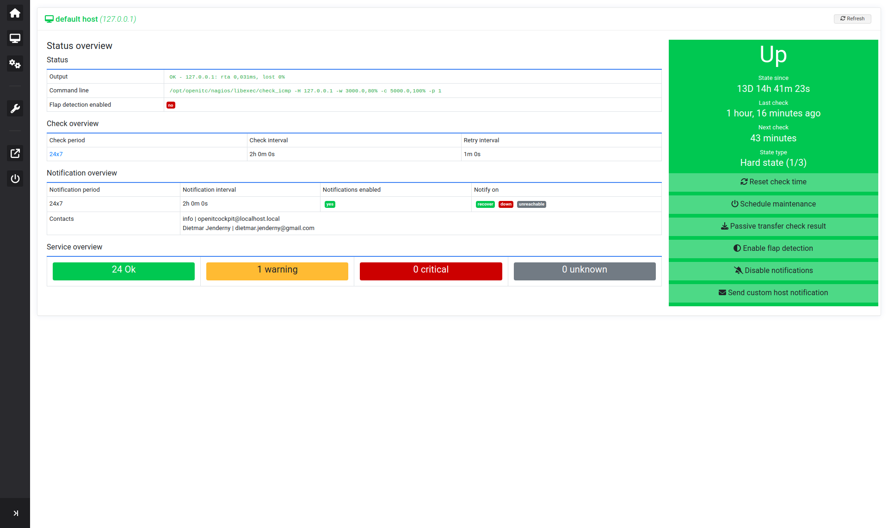
### Serviceslist
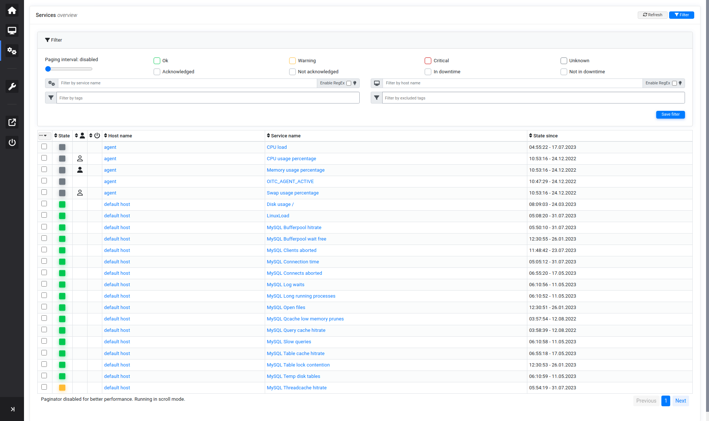
### Servicebrowser


## Custom Widgets
Mit Version 4.6.9 der openITCOCKPIT-Desktop App ist die Möglichkeit geschaffen worden, beliebig viele Widgets zu konfigurieren und anzuzeigen.
#### Verwaltung
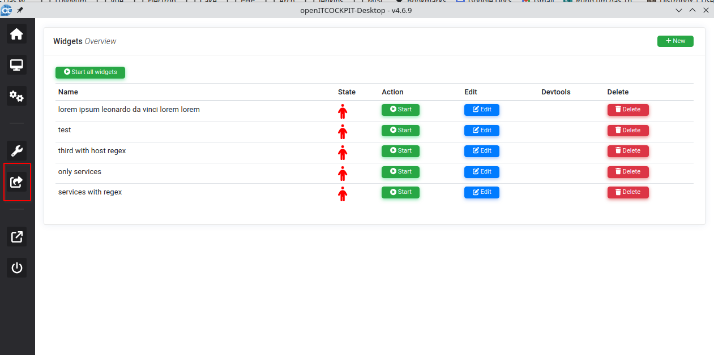
#### Konfiguration

Die Konfiguration der Widgets ist um die gekennzeichneten Felder erweitert worden. Die neuen Filter benötigen das openITCOCKPIT-Backend 4.7.0.
#### Anzeige
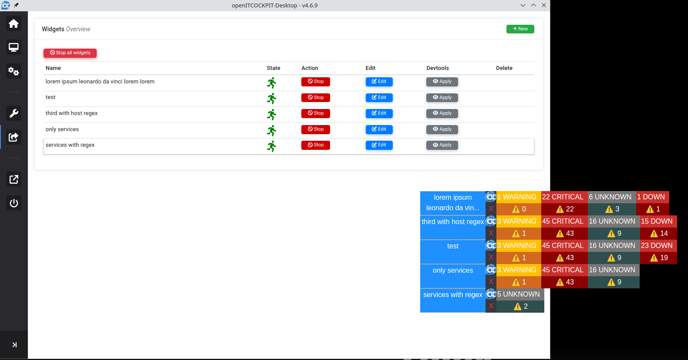

#### Bekannte Probleme

!!! info
    Wenn Sie Ihren Bildschirm mit Microsoft Teams übertragen, kann es passieren, das die Widgets teilweise im Hintergrund verschwinden.
    Das Problem kann durch einen Neustart der openITCOCKPIT Desktop Anwendung behoben werden.


